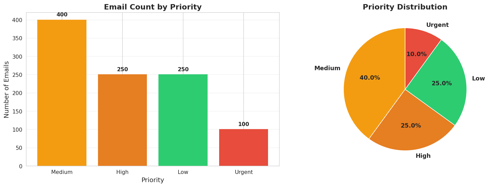
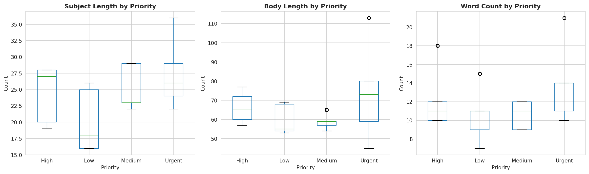
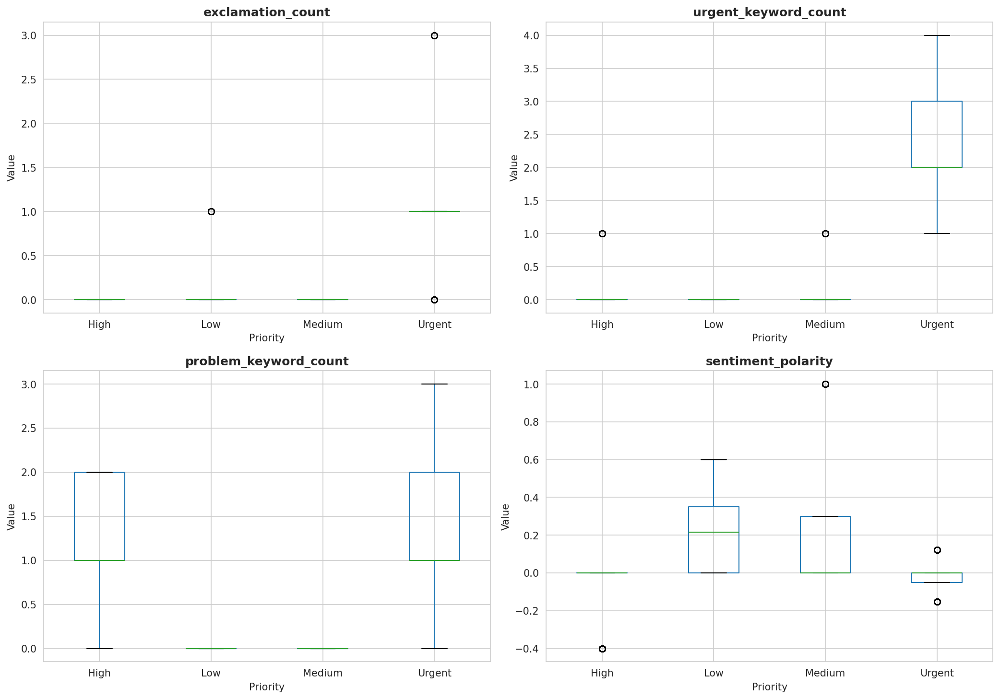

# TriageAI
> ML-powered email priority classification that gets your support team to the fires that matter — fast.

---

## The Problem

Customer support teams drown in email. Not all of it is urgent, but finding the emails that *are* urgent — before an angry enterprise client escalates — is a full-time job in itself.

**TriageAI automates that job.**

It reads incoming support emails and classifies them into four priority tiers: `Urgent`, `High`, `Medium`, and `Low` — so your team knows exactly where to look first.

---

## Results

| Metric | Score |
|---|---|
| Overall Accuracy | **82%** |
| Urgent Recall | **91%** |
| Model | Logistic Regression (class-balanced) |

> Urgent recall is the metric that matters most here. Missing an urgent email has real business consequences — a 91% catch rate means fewer fires slip through.

---

## How It Works

1. **Feature Engineering** — Raw email text is transformed into signals the model can use: subject length, body length, exclamation count, urgent keyword frequency, problem keyword count, and sentiment polarity.
2. **Class Balancing** — Urgent emails are ~10% of the dataset. Training uses `class_weight='balanced'` to prevent the model from ignoring the minority class.
3. **Logistic Regression** — Interpretable, fast, and effective. You can see exactly which features drive each prediction.

---

## Key Findings from EDA

- **Text length is a weak signal** — urgent emails aren't necessarily longer or shorter.
- **Exclamation marks matter** — urgent emails contain significantly more.
- **Keyword frequency is decisive** — urgent keyword count is the strongest single predictor.
- **Sentiment skews negative** — urgent and high-priority emails tend toward more negative polarity.

## Visualisations

### Priority Distribution


### Text Length by Priority


### Urgency Indicators by Priority


### Key Feature Distributions


---

## Quick Start

```bash
git clone https://github.com/Nyxox-debug/triageai.git
cd triageai

python -m venv venv
source venv/bin/activate

pip install -r requirements.txt
```

---

## Project Structure

```
triageai/
├── assets
│   ├── key_features_boxplots.png
│   ├── priority_distribution.png
│   ├── text_length_boxplots.png
│   └── urgency_indicators.png
├── data
│   ├── processed
│   │   ├── emails_with_features.csv
│   │   └── features_complete.csv
│   └── raw
│       └── emails.csv
├── models
│   ├── feature_engineering_metadata.json
│   ├── feature_names.json
│   ├── tfidf_vectorizer.pkl
│   └── train_test_data.pkl
├── notebooks
│   ├── 1-data-exploration.ipynb
│   └── 2-feature-engineering.ipynb
├── README.md
└── requirements.txt
```

---

## Tech Stack

- **Python 3.9+**
- **scikit-learn** — modelling & evaluation
- **pandas / numpy** — data wrangling
- **matplotlib** — visualisation
- **TextBlob / NLTK** — sentiment & keyword extraction

---

## Roadmap

- [ ] REST API for real-time classification
- [ ] Experiment with gradient boosting (XGBoost, LightGBM)
- [ ] Add confidence scores to predictions
- [ ] Dashboard for support team metrics

---

## License

MIT
